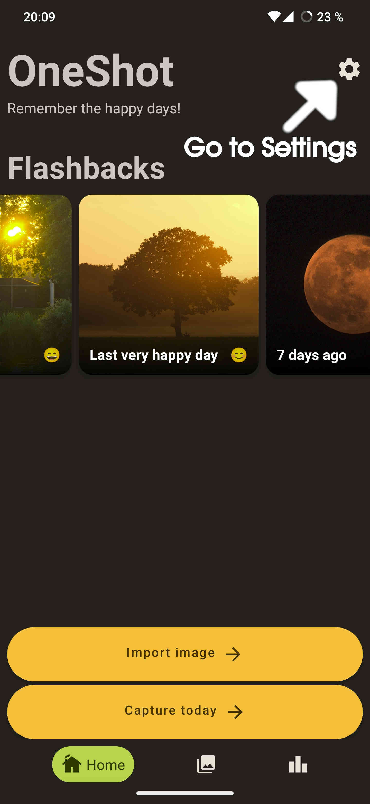
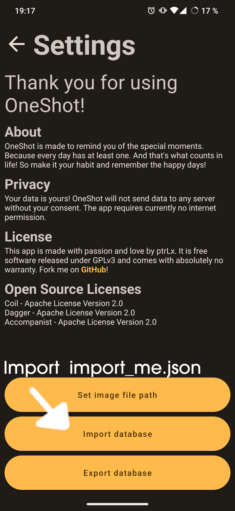

# OneShot import

Import images from the past into your [OneShot](https://github.com/ptrLx/OneShot) app.

## Requirements

* clone this repo
* install Python 3.11
* install pipenv (`pip install pipenv --user`)
* install tkinter for your OS
* run `pipenv install` and `pipenv shell`
* now run the script (`python3 src/main.py`)

## How it works

* select images from different dates that you want to import into your OneShot diary
* copy them into the `image` folder
* now run `src/main.py`
* it will generate a `import-me.json`
* copy the images into your OneShot folder on your device and use the import feature of the app to import the `import-me.json`:
  <div style="display:flex;">
  
  
  </div>

## Usage

```
usage: main.py [-h] [-y] [--summarize] [--no-summarize] [-p PATH] [-o OUTPUT] [--default-text DEFAULT_TEXT]
               [--default-happiness {NOT_SPECIFIED,VERY_HAPPY,HAPPY,NEUTRAL,SAD,VERY_SAD}]

Import images from the past into OneShot.

options:
  -h, --help            show this help message and exit
  -y, --yes             no confirmation request
  --summarize           summarize import results
  --no-summarize        disable summarization
  -p PATH, --path PATH  specify a path where the images are located
  -o OUTPUT, --output OUTPUT
                        specify a path where the export should be stored
  --default-text DEFAULT_TEXT
                        specify default text
  --default-happiness {NOT_SPECIFIED,VERY_HAPPY,HAPPY,NEUTRAL,SAD,VERY_SAD}
                        specify default happiness level
```
